# E-Bookstore — Architecture Diagrams

**Project:** AI-Assisted E-Commerce Bookstore (Capstone)
**Last Updated:** 2026-08-24
**Status:** Pre-implementation — diagrams reflect the intended architecture before DESIGN APPROVED

---

## Table of Contents

1. [Context Diagram (Level 0 DFD)](#1-context-diagram-level-0-dfd)
2. [Level 1 DFD — Major Processes](#2-level-1-dfd--major-processes)
3. [Level 2 DFD — Book Catalogue](#3-level-2-dfd--book-catalogue)
4. [Level 2 DFD — Cart Management](#4-level-2-dfd--cart-management)
5. [Level 2 DFD — Order Management](#5-level-2-dfd--order-management)
6. [Level 2 DFD — Checkout & Payment](#6-level-2-dfd--checkout--payment)
7. [Level 2 DFD — Recommendations](#7-level-2-dfd--recommendations)
8. [System Architecture Overview](#8-system-architecture-overview)
9. [Backend Module Map](#9-backend-module-map)
10. [Frontend Page Map](#10-frontend-page-map)
11. [Guest Cart Flow](#11-guest-cart-flow)
12. [Purchase Flow — Sequence Diagram](#12-purchase-flow--sequence-diagram)
13. [Order Cancellation Flow](#13-order-cancellation-flow)
14. [Gift Points Flow](#14-gift-points-flow)
15. [Authentication Flow](#15-authentication-flow)
16. [Seed Pipeline Flow](#16-seed-pipeline-flow)

---

## 1. Context Diagram (Level 0 DFD)

The system boundary and all external actors.

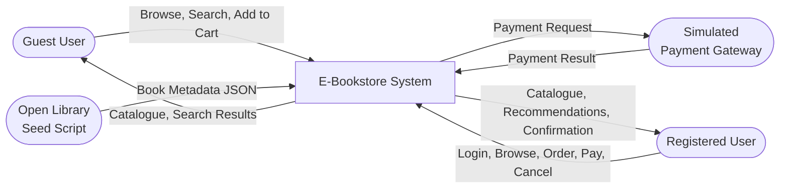

---

## 2. Level 1 DFD — Major Processes

The six top-level processes and their data stores.

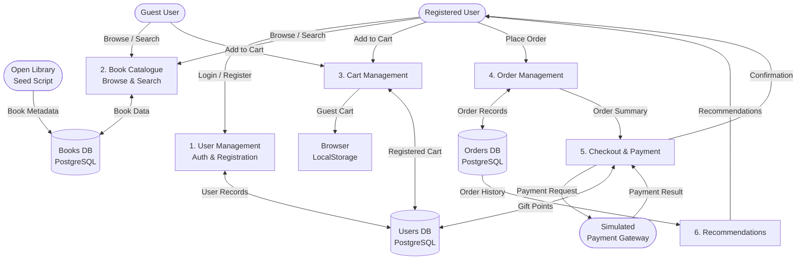

---

## 3. Level 2 DFD — Book Catalogue

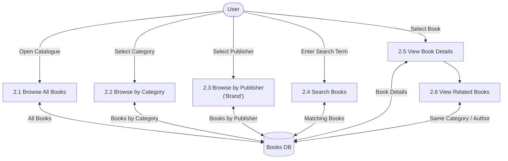

---

## 4. Level 2 DFD — Cart Management

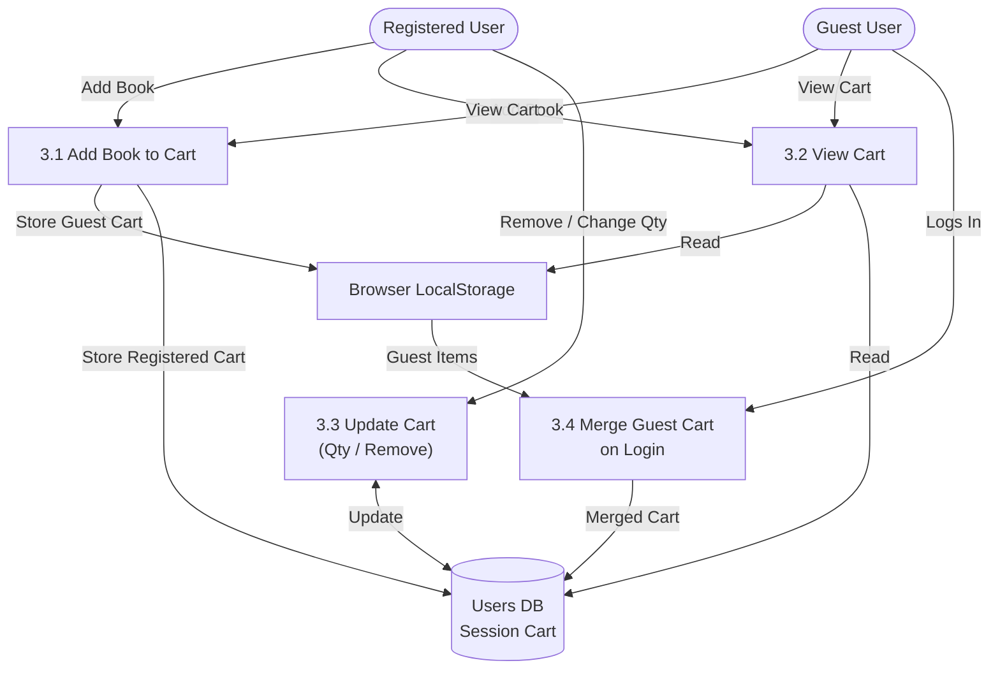

---

## 5. Level 2 DFD — Order Management

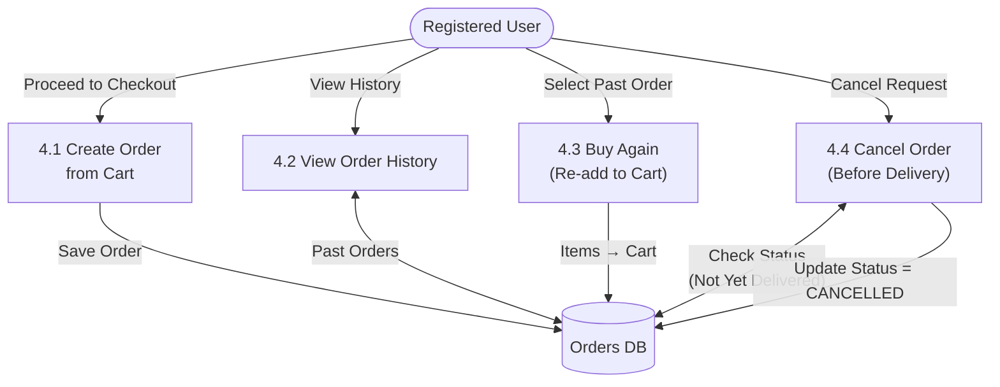

---

## 6. Level 2 DFD — Checkout & Payment

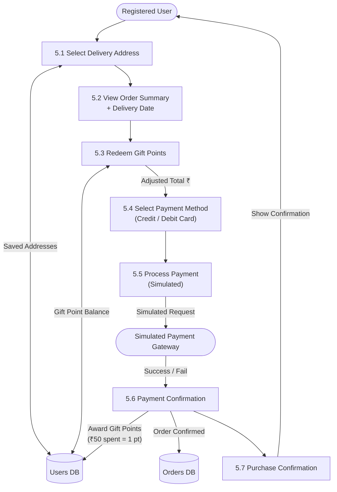

---

## 7. Level 2 DFD — Recommendations

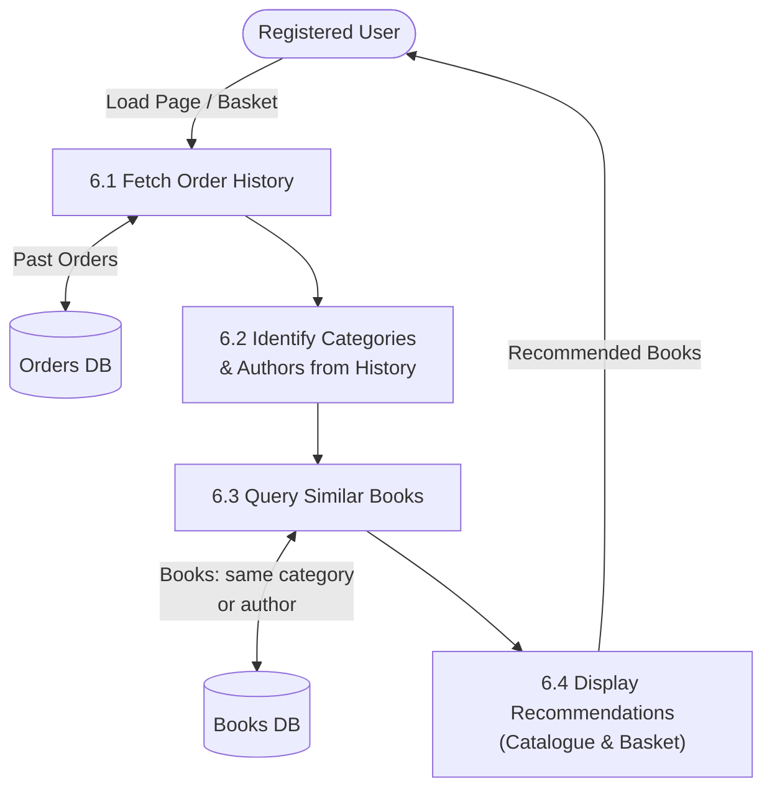

---

## 8. System Architecture Overview

High-level technology stack and communication paths.

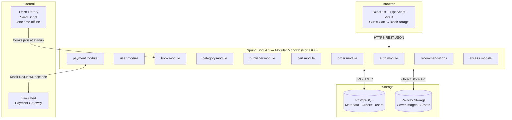

---

## 9. Backend Module Map

Internal structure of the Spring Boot modular monolith.

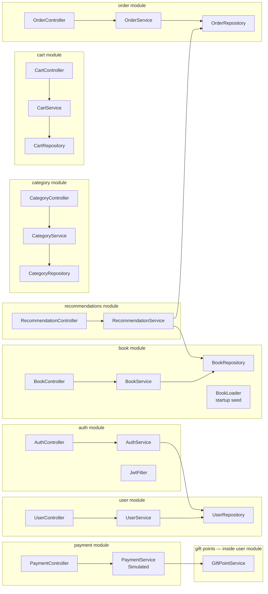

---

## 10. Frontend Page Map

React page and component tree (planned).

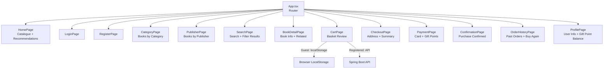

---

## 11. Guest Cart Flow

How a guest's cart is handled through login and merge.

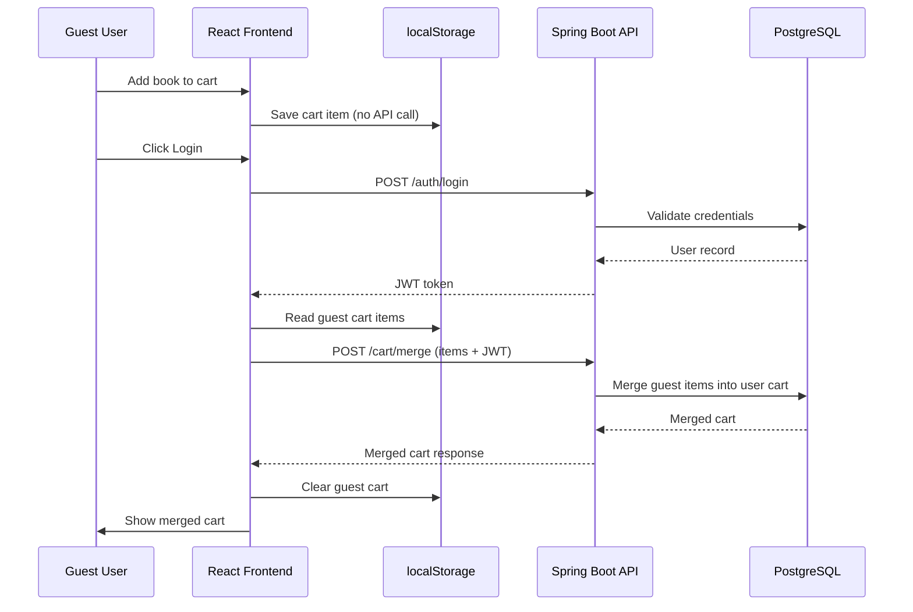

---

## 12. Purchase Flow — Sequence Diagram

End-to-end flow from cart to purchase confirmation.

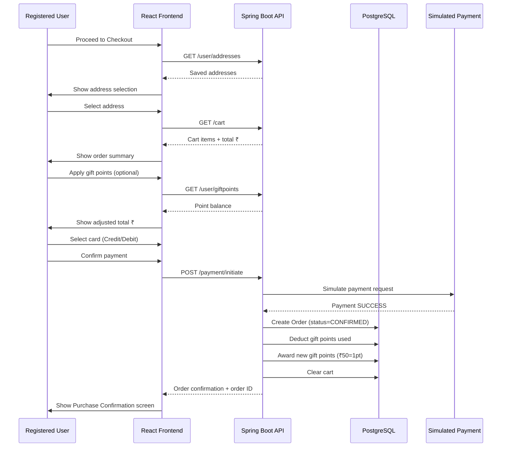

---

## 13. Order Cancellation Flow

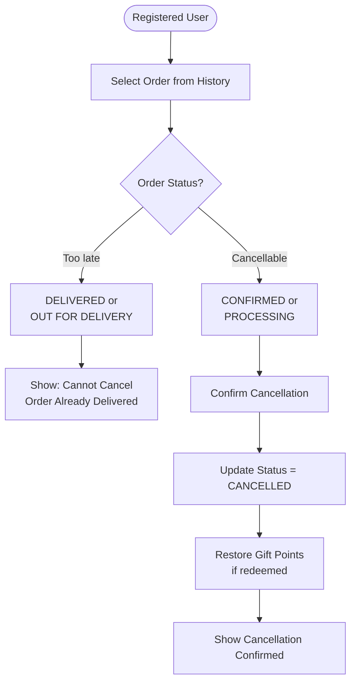

---

## 14. Gift Points Flow

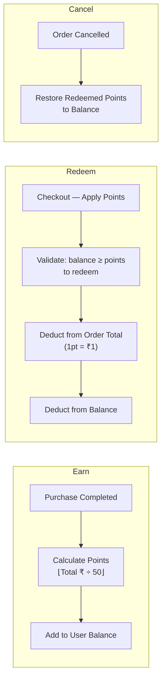

---

## 15. Authentication Flow

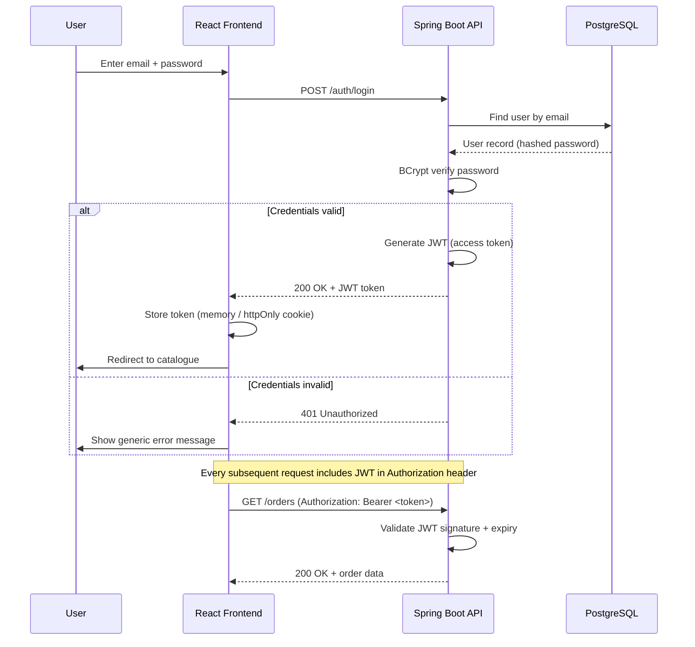

---

## 16. Seed Pipeline Flow

How the catalogue is populated before the application starts.

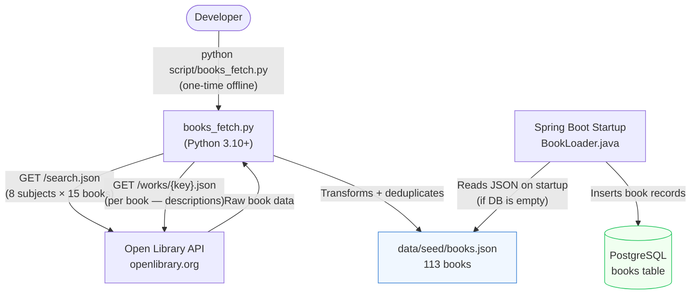

---

## Data Store Summary

| Store | Technology | Contains |
|---|---|---|
| `Users DB` | PostgreSQL | User accounts, addresses, gift point balances, registered cart |
| `Books DB` | PostgreSQL | Book metadata, categories, publishers |
| `Orders DB` | PostgreSQL | Orders, order items, order status |
| `Railway Storage` | Object Store | Cover images, future digital assets |
| `Browser LocalStorage` | Browser | Guest cart only — never sent to DB until login |

---

## External Entity Summary

| Entity | Role | Direction |
|---|---|---|
| Guest User | Browse, search, add to local cart | Inbound |
| Registered User | Full purchase flow | Inbound/Outbound |
| Open Library Seed Script | One-time offline catalogue population | Inbound |
| Simulated Payment Gateway | Mock payment success/fail response | Outbound/Inbound |

---

*All diagrams use [Mermaid](https://mermaid.js.org/) syntax and render natively in GitHub, VS Code, and most modern markdown viewers.*
